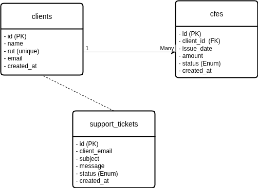

# Mini CFE (Electronic Invoice) Manager

---

## 🎯 Project Context

This is a full-stack web application developed in 3 days as a proactive response to a **Junior Programmer** job posting at an electronic invoicing company. The project's goal is to demonstrate the technical skills and business understanding required for the role, focusing on data management, client support simulation, and error handling.

The entire interface and data are in English to showcase language proficiency, a valued skill in the job description.

---

## 🧠 Development Process & Methodology

This project was executed in a 3-day sprint, leveraging an agile methodology and an iterative learning approach.

To accelerate the understanding of the business problem and explore technical best practices, I used an **AI as a "sparring partner" and technical mentor**.

My role in this process was that of the **lead architect and developer**:
*   **Asking the right questions** to define the project's scope and structure.
*   **Making key architectural decisions**, such as normalizing the database schema to ensure data integrity.
*   **Writing, debugging, and refactoring the final code**. The AI served as a guide, but all code was implemented and is fully understood by me.
*   **Solving complex, real-world problems**, such as debugging character encoding issues and resolving server environment configurations.

This approach allowed me to not only deliver a functional and relevant product in a record amount of time but also to ensure a deep understanding of every line of code and every design decision, all of which I am prepared to discuss in detail.

---

## ✨ Core Features

This application simulates the management of Electronic Fiscal Vouchers (CFE), mirroring the core tasks of the job role:

*   **📊 CFE Dashboard:** Displays a clear, paginated list of all issued invoices, with their corresponding status.
*   **➕ Manual CFE Creation:** A form to create individual invoices, demonstrating handling of user input and database insertion with security in mind.
*   **🔄 Status Updates (AJAX):** A "Process" button for pending CFEs simulates validation with a fiscal authority (DGI). It updates the status to "Approved" or "Error" asynchronously using JavaScript (`fetch` API) without a page reload.
*   **📂 Bulk Data Import:** A key feature addressing the **"Data Loading"** requirement. Users can upload a `.csv` file with multiple invoices. The backend script processes the file, validates each row by finding the client's RUT, and inserts the data efficiently.
*   **📄 Data Export:** Complements the import functionality by allowing the user to export the current list of CFEs to a `.csv` file.
*   **🎫 Support Ticket System:** A dedicated page (`support.php`) that simulates an internal view of client-reported incidents. This directly addresses the **"customer support"** and **"incident resolution"** components of the job description.

---

## 🛠️ Technology Stack

*   **Backend:** PHP
*   **Frontend:** Plain JavaScript (ES6+), HTML5, CSS3
*   **Database:** MySQL
*   **Deployment:** InfinityFree
*   **Key PHP Concepts Used:**
    *   **Prepared Statements (mysqli):** To prevent SQL injection in all database operations.
    *   **File Handling:** For processing CSV uploads.
    *   **JSON Handling:** For AJAX API responses.
*   **Key JavaScript Concepts Used:**
    *   **Fetch API:** For all asynchronous communication with the backend.
    *   **DOM Manipulation:** To update the UI in real-time without page reloads.
    *   **Event Handling:** To manage user interactions.

---

## 🗃️ Database Schema

The database was designed in a normalized way to ensure data integrity and avoid redundancy, using a one-to-many relationship between clients and their invoices.

---

## ⚙️ How to Run Locally

1.  Clone the repository: `git clone <repository-url>`
2.  Create a MySQL database and import the table structure using the queries in a `*.sql` file (or manually from the provided schema).
3.  Create a `db.php` file in the root directory based on the `db.php.example` template. Fill in your actual database credentials. This file is included in `.gitignore` and should not be committed.
4.  Serve the project from a local server environment that supports PHP (like XAMPP, WAMP, or PHP's built-in server).
